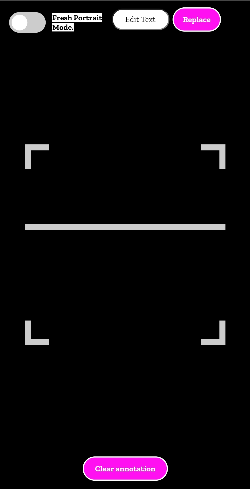

# Self Annotations
Annotations happening dynamically when user taps, made with the help of Mind-AR library. 
## Key features:
* The user can tap and create annotation arrows with **editable text**.  
* The Clear Annotation button works like an **undo feature** as it deletes your latest annotation that you created.
* The screen orientation needs calibration so your taps are pin-point accurate. Make sure your device is parallel to the image target.
* The "Portrait" and "Landscape" modes allow you to start creating new annotations, calibrated for accuracy in their respective modes.
* Switching from "Portrait" to "Landcape" (or vice-versa) also clears up the existing annotations. (Otherwise they might rotate as our parent plane is rotating).
* Your arrows will still be anchored to where they were created, **irrespective of orientation**, these modes are just for creation of fresh work.
* To edit text of your latest created annotation, just tap on input that is set to "Edit Text" by default, make desired change in the text and it will be reflected to the AR-text by simply hitting the **Replace** button.
* Edit text can edit your last annotation's text at all times. Means if you delete some annotations, whatever becomes your last can still be edited.
 
   
   
&nbsp;&nbsp;&nbsp;&nbsp;&nbsp;&nbsp;&nbsp;&nbsp;&nbsp;&nbsp;&nbsp;&nbsp;&nbsp;&nbsp;&nbsp;&nbsp;&nbsp;&nbsp;&nbsp;&nbsp;&nbsp;&nbsp;&nbsp;&nbsp;&nbsp;&nbsp;&nbsp;&nbsp;&nbsp;&nbsp;&nbsp;&nbsp;&nbsp;&nbsp;&nbsp;&nbsp;&nbsp;&nbsp;&nbsp;&nbsp;&nbsp;&nbsp;&nbsp;&nbsp;&nbsp;&nbsp;&nbsp;&nbsp;&nbsp;&nbsp;&nbsp;&nbsp;&nbsp;&nbsp;&nbsp;&nbsp;&nbsp;&nbsp;&nbsp;&nbsp;&nbsp;&nbsp;&nbsp;&nbsp;&nbsp;&nbsp;&nbsp;&nbsp;&nbsp;&nbsp;&nbsp;&nbsp;&nbsp;&nbsp;&nbsp;&nbsp;&nbsp;&nbsp;&nbsp;&nbsp;&nbsp;&nbsp;</img> 
